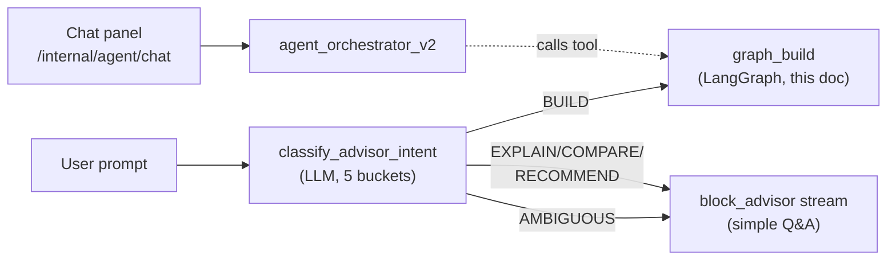
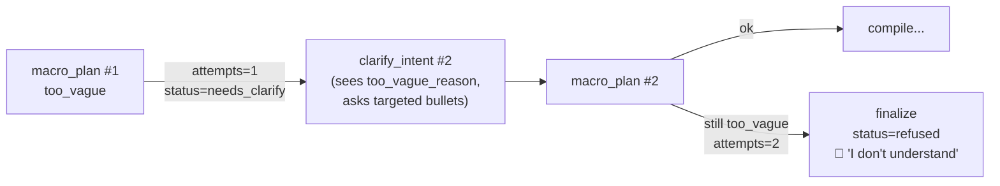
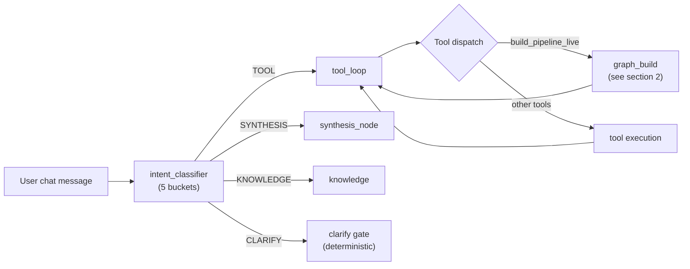
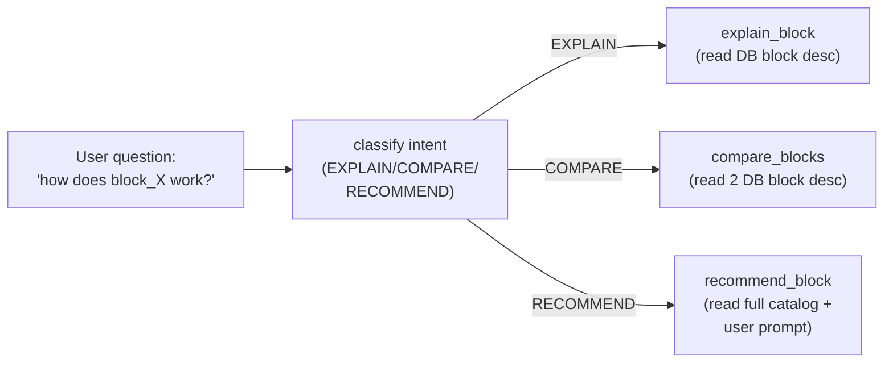

# Agent Workflow (v18, 2026-05-14)

Three agent surfaces share the same `python_ai_sidecar` runtime but enter different orchestrators. This doc shows the **Builder graph** (used by Skill Builder + Chat's `build_pipeline_live` tool) in detail since that's the most graph-heavy. Chat Orchestrator v2 + Block Advisor are summarised separately.

---

## 1. Routing entrypoint (`/internal/agent/build`)



---

## 2. Builder Graph (LangGraph state machine)

```mermaid
flowchart TD
    START([START]) --> CL["clarify_intent_node<br/>(LLM: intent bullets<br/>+ block preview)"]

    CL -->|skip_confirm=true<br/>chat mode (today)| MP["macro_plan_node<br/>(LLM: pick blocks +<br/>compose plan)"]
    CL -.->|"⏸ intent_confirm_required<br/>(skill mode)"| PAUSE1{{"PAUSE<br/>frontend renders<br/>BulletCard<br/>user ✓✗"}}
    PAUSE1 -.->|"/build/clarify-respond<br/>resume"| MP

    MP -->|too_vague<br/>attempts < 2| CL
    MP -->|too_vague<br/>attempts ≥ 2| FIN["finalize_node<br/>status=refused"]
    MP -->|status=needs_clarify| CL
    MP -->|skip_confirm=true| CR["canvas_reset_node"]
    MP -->|skill_step_mode<br/>or builder mode| CG{{"PAUSE<br/>confirm_gate<br/>user ✓ Apply"}}

    CG -.->|user Apply| CR
    CG -.->|user modify| PL["plan_node<br/>(legacy replan)"]
    CG -.->|user cancel| FIN

    PL --> VA["validate_plan_node<br/>(schema + col refs)"]
    VA -->|errors| RP["repair_plan_node<br/>(LLM)"]
    RP --> VA
    VA -->|max retries| FIN
    VA -->|ok + macro_plan| CG
    VA -->|ok + no macro| CR

    CR --> CC["compile_chunk_node<br/>(LLM per macro step)<br/>+ 9 deterministic autofixes"]
    CC -->|retry<br/>(validation fail)| CC
    CC -->|ok| DO["dispatch_op_node"]
    DO --> CT["call_tool_node<br/>(executor.execute add_node/<br/>connect/set_param)"]

    CT -->|ok + more ops in chunk| DO
    CT -->|chunk done +<br/>more macro steps| AMS["advance_macro_step"]
    AMS --> CC
    CT -->|all chunks done| FIN
    CT -->|op error| RO["reflect_op_node<br/>(LLM patches 1 op)"]
    CT -->|repair_op suggested| ROP["repair_op_node<br/>(LLM retries op)"]
    RO --> CT
    ROP --> CT
    CT -->|severe error| RP

    FIN --> IE["inspect_execution_node<br/>(dry_run + semantic check)"]
    IE -->|issues + budget left| RFP["reflect_plan_node<br/>(LLM rewrites plan)"]
    RFP --> VA
    IE -->|ok / no budget /<br/>status=finished| LO["layout_node<br/>(canvas positions)"]
    LO --> END([END])
```

### Node responsibilities

| Node | Role | LLM? | Output |
|---|---|---|---|
| `clarify_intent` | Restate user prompt as bullets; ask for confirmation in skill mode | ✓ | bullets[] + previews |
| `macro_plan` | Decompose to 1-6 atomic steps; pick candidate block per step | ✓ | macro_plan[] |
| `confirm_gate` | Pause for user Apply (skill mode + builder mode) | ✗ (interrupt) | confirmation |
| `canvas_reset` | Clear leftover nodes from prior builds | ✗ | empty plan |
| `compile_chunk` | Generate add_node/connect/set_param ops for 1 macro step | ✓ | ops[] |
| `dispatch_op` | Pick next op from plan | ✗ | one op |
| `call_tool` | Execute the op (add_node / connect / set_param / remove_node) | ✗ | exec_trace snapshot |
| `reflect_op` | When op fails, LLM patches just that one op | ✓ | patched op |
| `repair_op` | Like reflect_op but smaller scope (retry same op with tweaked params) | ✓ | retried op |
| `repair_plan` | When plan validator fails, LLM rewrites whole plan | ✓ | new plan |
| `finalize` | Build PipelineJSON; run dry-run for inspect | ✗ | final_pipeline |
| `inspect_execution` | Scan dry-run results for semantic issues | ✗ | issues[] |
| `reflect_plan` | When dry-run shows semantic problems, LLM rewrites plan | ✓ | new plan |
| `layout` | Compute canvas xy positions for each node | ✗ | positions |

### Deterministic autofixes inside `compile_chunk` (run before validation)

1. `_auto_insert_unnest` — prepend block_unnest when filter references nested leaf
2. `_auto_rewire_chart_chains` — rewire chart→data mistakes to dataframe upstream
3. `_autocorrect_filter_values` — fuzzy match (e.g. 'xbar' → 'xbar_chart')
4. `_autostrip_singleton_groupby` — drop high-cardinality group_by that collapses to n=1
5. `_normalize_select_fields` — string array → [{path:x}] object array
6. `_normalize_set_param_ops` — fold malformed set_param into matching add_node
7. `_drop_unspecced_cpk` — drop block_cpk when no usl/lsl
8. **`_force_skill_terminal` (v18)** — in skill mode last step, rewrite block_threshold → block_step_check
9. **`_autocorrect_column_refs` (v18)** — fuzzy match invented column names against upstream cols
10. `_drop_malformed_ops` — drop ops with None ids
11. `_resolve_input_refs` — substitute $X with bracketed literals from instruction
12. `_dedup_against_plan` — drop add_node duplicates by logical_id

---

## 3. Reject-and-ask loop (v18)

When `macro_plan_node` returns `too_vague`:



---

## 4. Chat orchestrator (separate flow)



Chat path is simpler — uses an Anthropic native tool-use loop, no LangGraph state machine. The complexity is in `graph_build` (section 2) which it calls as a tool.

---

## 5. Block Advisor (sub-flow for non-BUILD intents)



No LangGraph, no state. Pure 1-LLM-call-per-bucket lookups against `pb_blocks` DB.

---

## Status values produced by the build graph

| Status | Meaning | When seen in trace |
|---|---|---|
| `running` | Initial state | only during execution |
| `intent_confirm_required` | Paused at clarify_intent waiting for user ✓✗ | sidebar status badge |
| `needs_clarify` | macro_plan too_vague, looping back to clarify | transient, not usually visible |
| `confirm_pending` / `needs_confirm` | Paused at confirm_gate waiting for Apply | builder canvas |
| `refused` | Too vague after 2 attempts; agent gave up | banner: ✋ Refused |
| `failed` | Build couldn't produce any nodes | banner: ✗ Failed |
| `failed_structural` | Built nodes but pipeline is structurally broken | banner: ✗ Structural error |
| `finished` | Build success, dry-run also passed | green ✓ |
| `cancelled` | User clicked Cancel at confirm_gate | neutral |

---

## Files (where to look in code)

- Graph definition: `python_ai_sidecar/agent_builder/graph_build/graph.py`
- Nodes: `python_ai_sidecar/agent_builder/graph_build/nodes/`
- Tracer (writes /tmp/builder-traces/*.json): `python_ai_sidecar/agent_builder/graph_build/trace.py`
- Streaming runner: `python_ai_sidecar/agent_builder/graph_build/runner.py`
- Block executors (50+): `python_ai_sidecar/pipeline_builder/blocks/`
- Block catalog (LLM-visible descriptions): `python_ai_sidecar/pipeline_builder/seed.py`
- Chat orchestrator: `python_ai_sidecar/agent_orchestrator_v2/`
- Block advisor: `python_ai_sidecar/agent_builder/advisor/`

For real-time inspection of any build, open `/admin/build-traces` on aiops-app.
